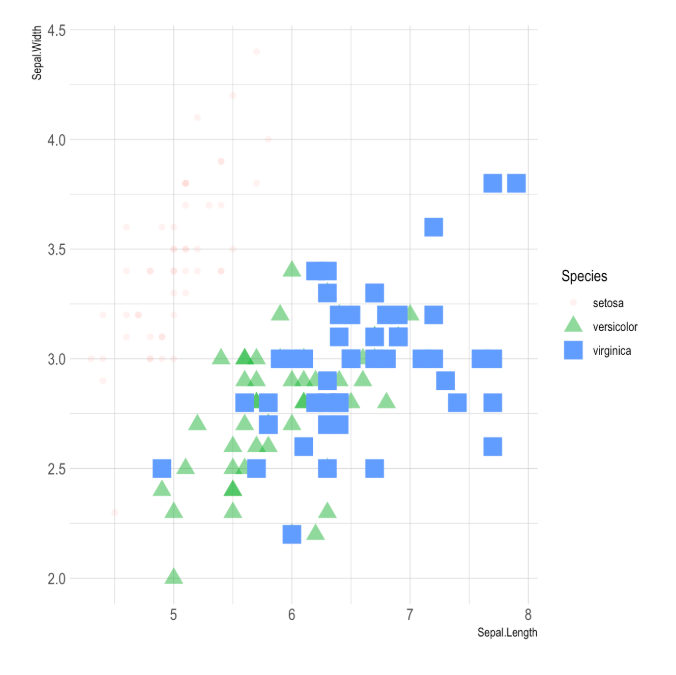
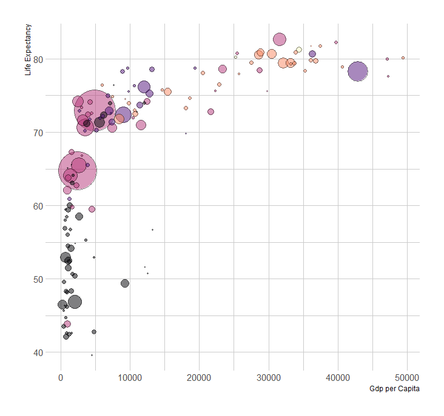
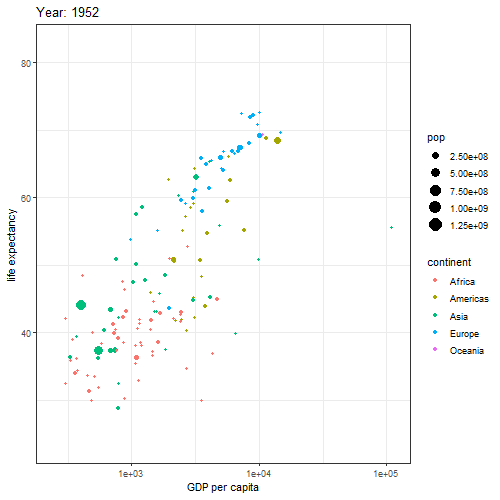
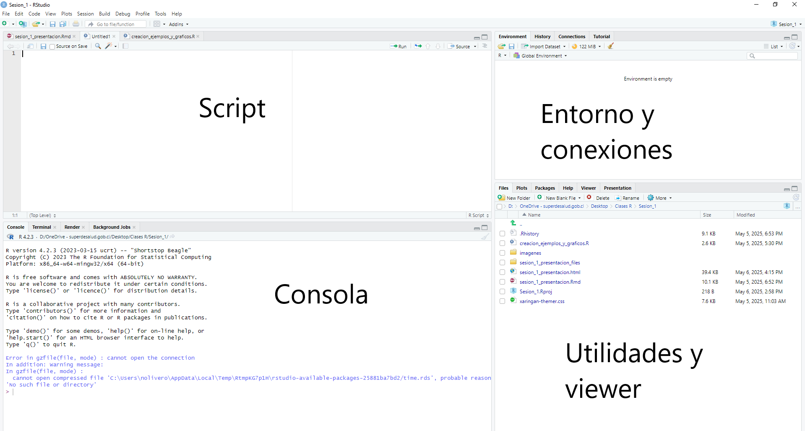

class: center, middle

.linea-superior[]
.linea-inferior[]


# Curso Capacitación en R 

## Sesión 1 

## Reglas del juego y nociones iniciales de R y R Studio

### Mayo 2025

```{r setup, include=FALSE} 
options(htmltools.dir.version = TRUE)
knitr::opts_chunk$set(message = FALSE) 
```


```{r xaringan-themer, include=FALSE, warning=FALSE}
library(xaringanthemer) # gfonts
xaringanExtra::use_clipboard()
xaringanExtra::use_editable(id = "xaringanExtra-editable-demo-1", expires = 1)
```
---

background-image: url("imagenes/background.png")
background-size: contain;
background-position: 50% 0%


--
<br/>
Bienvenidos a la primera sesión del curso **Introducción a R**. 😄

--

Mi nombre es **Nicolás Olivero** y seré su tutor en este curso.

--

Por favor, cualquier duda, sugerencia, comentario y/o crítica enviar un correo a **nolivero@superdesalud.gob.cl** o hablarme por Teams.

--

.medium-par[Este **ambicioso** curso busca:]

--

.medium-par[*Entregar las nociones básicas en materia de procesos de .red[carga], .red[limpieza], .red[manipulación] y .red[visualización] de bases de datos mediante la utilización de las librerías más relevantes como **dplyr**, **ggplot2** y **R Markdown.** *] 

---

background-image: url("imagenes/background.png")
background-size: contain;
background-position: 50% 0%

# Reglas del juego

--

Carácteristicas del curso:

--

- 9 sesiones de 1 hora y media los días jueves de 11 a 12:30 horas.

--

- Las clases utilizarán una presentación y si es que realizamos ejercicios se compartirá el script correspondiente.

--

- Al final de todas las clases (con excepción de la primera) se entregará una tarea que debe ser entregar antes de la siguiente clase. 
--

- Se puede faltar un máximo de 1 clase sin justificación y 2 con justificación (correo con copia a jefatura). Tres inasistencias significará reprobación.

--

- La principal ventaja de tomar este curso es que tiene como objetivo que cada uno de ustedes sea capaz de **automatizar** algun proceso asociado en su trabajo del día a día. A esto lo llamaremos **Proyecto en R**.

--

- Dado lo anterior, para poder aprobar el curso se deben cumplir **tres** condiciones: cumplir la asistencia requerida, aprobar en promedio las tareas entregadas y realizar el proyecto en R.

---

background-image: url("imagenes/background.png")
background-size: contain;
background-position: 50% 0%

# Proyecto en R

--

El proyecto en R tiene dos objetivos:

--

1. *Forzar* a que mantengan el uso constante de R para la resolución de tareas.

--

2. Demostrar en la práctica cómo la utilización de R permite generar procesos más eficientes de trabajo.

--

Tendrán desde hoy hasta la próxima semana para definir un proyecto donde se deben especificar las siguientes características:

--

- Breve descripción de la tarea y cómo actualmente se realiza.

--

- Cantidad de tiempo que requiere esta tarea.

--

- Propuesta de solución (a grandes rasgos).

--

- Luego de generar la propuesta de solución (al final del curso) calcular la ganancia en productividad.

--

.medium-par[**Consejo:** A pesar que este es un curso introductorio... ¡sean **ambiciosos** con su proyecto! 😎]


---

background-image: url("imagenes/background.png")

class: center, middle

.linea-superior[]
.linea-inferior[]


.big-par[¿Dudas hasta el momento?]

--

.big-par[¿Qué saben de R? ¿Por qué lo necesitan? 🤓]


---

background-image: url("imagenes/background.png")
background-size: contain;
background-position: 50% 0%

# ¿Qué es R?

--

**R** es un lenguaje de programación con enfoque al análisis estadístico desarrollado por investigadores de la Universidad de Auckland en 1993.

--

## ¿Por qué (utilizar) R?

--

- Es gratuito, de código abierto y está disponible en todas las plataformas principales. Por lo tanto, si realiza su análisis en R, cualquiera puede replicarlo fácilmente, sin importar dónde viva o cuánto gane.

--

- **R** tiene una comunidad diversa y acogedora tanto online como reuniones presenciales.

--

- Existe una cantidad **enorme** de paquetes para modelado estadístico, aprendizaje de máquinas, visualización, e importanción y manipulación de datos. Cualquier modelo o gráfico que se busque hacer, **seguramente** alguien ya ha tratado de hacerlo y se puede aprender de ellos.

--

- Potentes herramientas para la comunicación y difusión de resultados como **R Markdown** y **Shiny**.

---

background-image: url("imagenes/background.png")
background-size: contain;
background-position: 50% 0%

## ¿Por qué (utilizar) R? (continuación)

- Herramientas de vanguardia donde investigadores de diversos ámbitos pueden publicar paquetes en R acompañando sus artículos y papers.

--

- **R** cuenta con un IDE (*integrated development environment*) construido a su medida (R Studio), facilitando su uso y manejo.

--

En mi visión personal:

--

- **R** es un lenguaje que cumple con todos los requisitos que necesita un analista para manejar profundamente datos e información.

--

- Posee una curva de aprendizaje muy abordable. No se necesita ser ni informático ni tener experiencia previa en programación para aprenderlo.

--

- Las herramientas de visualización y de difusión de información en R son de **muy alto nivel**.

--

Pero... **mejor mostrarles algunos casos para que me crean** 😇

---
background-image: url("imagenes/background.png")
background-size: contain;
background-position: 50% 0%

# Ejemplos de visualización
<br/>

--

.pull-left[]

--

.pull-right[]

---

background-image: url("imagenes/background.png")
background-size: contain;
background-position: 50% 0%

# Más visualización...
<br/>

--

.pull-left[]

--

.pull-right[]

---

background-image: url("imagenes/background.png")
background-size: contain;
background-position: 50% 0%

# Maaaaaás visualización...
<br/>

--


```{r plotly, echo=FALSE, fig.align='center'}
library(ggplot2)
library(dplyr)
library(plotly)
library(viridis)
library(hrbrthemes)

# The dataset is provided in the gapminder library
library(gapminder)
data <- gapminder %>% filter(year=="2007") %>% dplyr::select(-year)

# Interactive version
p <- data %>%
  mutate(gdpPercap=round(gdpPercap,0)) %>%
  mutate(pop=round(pop/1000000,2)) %>%
  mutate(lifeExp=round(lifeExp,1)) %>%
  
  # Reorder countries to having big bubbles on top
  arrange(desc(pop)) %>%
  mutate(country = factor(country, country)) %>%
  
  # prepare text for tooltip
  mutate(text = paste("Country: ", country, "\nPopulation (M): ", pop, "\nLife Expectancy: ", lifeExp, "\nGdp per capita: ", gdpPercap, sep="")) %>%
  
  # Classic ggplot
  ggplot( aes(x=gdpPercap, y=lifeExp, size = pop, color = continent, text=text)) +
  geom_point(alpha=0.7) +
  scale_size(range = c(1.4, 19), name="Population (M)") +
  scale_color_viridis(discrete=TRUE, guide=FALSE) +
  theme_ipsum() +
  theme(legend.position="none")

# turn ggplot interactive with plotly
pp <- ggplotly(p, tooltip="text")

```

.center[`r pp`]

---

background-image: url("imagenes/background.png")
background-size: contain;
background-position: 50% 0%

# Reportería y difusión
<br/>

--

.medium-par[Dashboards:]

--

- <https://pkgs.rstudio.com/flexdashboard/articles/examples.html>

--

.medium-par[Boletines de difusión oficiales:]

--

- <https://www.ine.gob.cl/docs/default-source/índice-de-precios-al-consumidor/boletines/español/2025/boletin-índice-de-precios-al-consumidor-enero-2025.pdf?sfvrsn=47290d68_4>

- <https://www.ine.gob.cl/docs/default-source/ocupacion-y-desocupacion/boletines/2025/nacional/ene-nacional-318.pdf?sfvrsn=51dfaa0f_5>

---
background-image: url("imagenes/background.png")
background-size: contain;
background-position: 50% 0%

# Herramientas de productividad

--

.medium-par[OCR:]

--

- <https://cran.r-project.org/web/packages/tesseract/vignettes/intro.html#Read_from_PDF_files>

--

.medium-par[Otros:]

--

- Clasificación automatizada

--

- Script de limpieza y/o unión de diferentes bases

--

- Generación automatizada de presentaciones
--
 (*esta presentación está hecha en R* 😸)

--

- Otros


---
background-image: url("imagenes/background.png")
background-size: contain;
background-position: 50% 0%

class: center, middle

.center[.big-par[**Importante:** R =/= R Studio]]

---

class: center, middle

.linea-superior[]
.linea-inferior[]


.big-par[Abramos RStudio]


---

background-image: url("imagenes/background.png")
background-size: contain;
background-position: 50% 0%

# Interfaz R Studio

.center[]

---

background-image: url("imagenes/background.png")
background-size: contain;
background-position: 50% 0%

# Formas de interactuar en R 
<br/>
--

.medium-par[1- **Consola**]

--

<br/> .medium-par[2-  **Script**]

--

¿Se les ocurren razones para utilizar .pur[scripts] en vez de la consola?

--

<br/> .medium-par-red[Orden y reproducibilidad]

--

<br/> Para ejecutar código en *scripts* se puede utilizar el *shortcut* .pur[Ctrl + Enter].

---

background-image: url("imagenes/background.png")
background-size: contain;
background-position: 50% 0%

# Primera interacción: R como calculadora

```{r }
10 + 7 # adición

```
--
```{r }
8 * 7 # multiplicación

```
--
```{r }
25 / 5 # división

```
--
```{r }
6 + 5 * 4 + 3     # sin utilizar paréntesis
(6 + 5) * (4 + 3) # utilizando paréntesis
```

---

background-image: url("imagenes/background.png")
background-size: contain;
background-position: 50% 0%

# Operadores aritméticos 1

```{r }
3 + 4      # adición
5 - 2      # sustracción
7 * 7      # multiplicación
56 / 8     # división

```

---

background-image: url("imagenes/background.png")
background-size: contain;
background-position: 50% 0%

# Operadores aritméticos 2

```{r }

4^3        # Exponenciación 1
4**3       # Exponenciación 2
56%%5      # ¿Qué hace?
10%/%4     # ¿Qué hace?

```

---
background-image: url("imagenes/background.png")
background-size: contain;
background-position: 50% 0%


# Operadores de comparación 1
<br/><br/>
```{r }

3 == 3        # igualdad
3 != 3        # no igualdad
10 > 14       # mayor a

```

---
background-image: url("imagenes/background.png")
background-size: contain;
background-position: 50% 0%

# Operadores de comparación 2
<br/><br/>
```{r }

10 < 14       # menor a
20 >= 19      # mayor o igual a
19 <= 19      # menor o igual a
```

---

background-image: url("imagenes/background.png")
background-size: contain;
background-position: 50% 0%

# Operadores lógicos

```{r }
TRUE | TRUE       # O
TRUE | FALSE      # O
TRUE & TRUE       # Y
TRUE & FALSE      # Y
!FALSE             # NO
```

---

background-image: url("imagenes/background.png")
background-size: contain;
background-position: 50% 0%

# Clases básicas de datos 

1. `numeric`: cualquier número real, ie. .pur[1], .pur[3], .pur[4.5], $\pi$, etc.<br/><br/>

--
2. `character`: cadena de caracteres o caracteres individuales, ie. .pur["Hola"], .pur["HoL"], .pur["H"], .pur["Hola buenos días"], .pur["78"] etc.<br/><br/>

--
3. `integer`: cualquier número **entero**, ie. .pur[1], .pur[3], .pur[100], .pur[5420], etc.<br/><br/>

--
4. `factor`: variables categóricas/cualitativas. Veremos su uso en próximas sesiones.<br/><br/>

--
5. `logical`: variables booleanas/lógicas. Pueden tomar los valores .pur[TRUE] o .pur[FALSE].<br/><br/>

--
6. `Date / POSIXct`: variables que representan tiempo y fechas de calendario. Pueden tomar los valores como .pur["2025-05-07"] o .pur["2025-05-04 16:11:54 -04"].<br/><br/>

---

background-image: url("imagenes/background.png")
background-size: contain;
background-position: 50% 0%

# Conociendo la primera función: class()

--

La función `class()` recibe un tipo de dato y entrega la clase que lo describe. Por ejemplo:

--

```{r }
class(2)
```

--

```{r }
class("Lucas")
```

--

Las funciones incluidas en R tanto como las funciones incluidas en paquetes del repositorio CRAN incluyen documentación asociada para entender como funcionan.

--

La forma de acceder a esta documentación es mediante el uso del símbolo `?` antes de la función o utilizando la función `help()`.

---

background-image: url("imagenes/background.png")
background-size: contain;
background-position: 50% 0%

# Conociendo la primera función: class()

--

```{r eval=FALSE}
?class()
```

--

```{r eval=FALSE}
help("class")
```

---

background-image: url("imagenes/background.png")
background-size: contain;
background-position: 50% 0%

# IMPORTANTE: operador de asignación

--

Todo en .pur[R] es un .pur[objeto] y estos pueden ser prácticamente cualquier cosa, desde un número, letras, palabras, o incluso bases de datos enteras, gráficos complejos, summary/resumen/output de análisis estadístico, etc.

--

El operador de asignación está compuesto por el símbolo *menor a* `<` y un guión `-`, es decir, `<-`.

--

```{r }
a <- 4
```

--

Asignando variables a estos objetos podemos realizar las operaciones vistas anteriormente.

--

```{r }
b <- 5

c <- a + b

c

```

--

¿Qué está ocurriendo en la parte de ambiente de R Studio cuando asignan objetos?
---

background-image: url("imagenes/background.png")
background-size: contain;
background-position: 50% 0%

# Juguemos un poco con asignaciones


.pull-left[
### 🧐; Probar

.can-edit.key-likes[

]
]


.pull-right[
### 😯; ¿Qué entrega?

.can-edit.key-dislikes[

]
]

---
background-image: url("imagenes/background.png")
background-size: contain;
background-position: 50% 0%

# Librerías y repositorios

--

Actualmente existen más de 22406 paquetes disponibles en el repositorio de paquetes .pur[CRAN] creado por usuarios individuales, instituciones, investigadores, etc.

--

En el transcurso de la capacitación utilizaremos distintos paquetes o librerías que nos aportarán con una mayor cantidad y calidad de funciones y herramientas que el .pur[R base] no posee.

--

Para instalar una determinada librería se utiliza la función `install.packages()` de la siguiente manera:

--

```{r eval=FALSE}
install.packages("tidyverse") # para instalar se deben utilizar las comillas!
```

--

Si todo funciona bien, veremos la librería en la pestaña .pur[packages] en la zona de utilidades de R Studio. ¿La encuentran?

--

Pero... luego de instalar, ¿esto quiere decir que ya podemos utilizar las funcionalidades de la librería? 
--
.red[**NO**]. 
--
Para utilizar o cargar una librería se debe correr el comando o función `library()` de la siguiente manera:

```{r eval=FALSE}
library(tidyverse) # para cargar una librería ya no necesitamos las comillas!
```

---

background-image: url("imagenes/background.png")
background-size: contain;
background-position: 50% 0%

# Consejos finales

--

- No se asusten si al correr algún código ven muchas cosas .red[rojas]. ¡Equivocarse es lo mejor que les puede pasar para así aprender y saber efectivamente lo que sucede dentro del programa!

--

- No ocupen Chatgpt u otro software de inteligencia artificial como primera opción. Es mejor googlear, buscar y leer la documentación y a otras personas antes que directamente preguntarle a una IA. Las IA's aún se equivocan mucho y puede que les entreguen un código que funcione, pero puede que no sea necesariamente el más eficiente o utilice funciones engorrosas y equívocas.

--

- Traten de al menos 10 minutos todos los días abrir un archivo en R Studio. Piensen que les gustaría hacer con él o qué requieren procesar o analizar. Traten de hacerlo, equivóquense y durante el curso vamos solucionando esas dudas.

--

- ¡Pásenlo bien y disfruten el curso! La idea es que aprendan **R**, lo utilicen y puedan hacer más eficiente algún proceso de su día a día y así tener más tiempo para dedicarle a otras cosas.
--
💻
--
👨‍👩‍👦‍👦 
--
⚽😴
--
🍻
