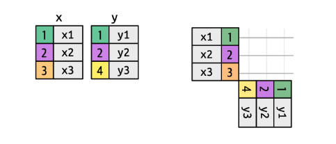

class: center, middle

.linea-superior[]
.linea-inferior[]


# Curso Capacitación en R 

## Sesión 5 

## Bases de datos 3 (importación y herramientas de utilidad)

### Junio 2025

```{r setup, include=FALSE} 
options(htmltools.dir.version = TRUE)
knitr::opts_chunk$set(message = FALSE) 
```


```{r xaringan-themer, include=FALSE, warning=FALSE}
library(xaringanthemer) # gfonts
xaringanExtra::use_clipboard()
xaringanExtra::use_editable(id = "xaringanExtra-editable-demo-1", expires = 1)
```
---

background-image: url("imagenes/background.png")
background-size: contain;
background-position: 50% 0%

# Entendiendo directorios

--

Para mantener un trabajo ordenado en cuanto a bases a cargar y exportar, es 
necesario saber correctamente en qué lugar nos encontramos. Debido a esto, se hace
relevante conocer la forma en que se estructuran las carpetas y como R puede 
interactuar con ellas.

--

```{r }
getwd() # imprime el lugar donde nos encontramos en este momento
```
Para cambiar de lugar (cambiar de directorio) utilizamos la función `setwd()`.

```{r eval=FALSE}
# "D:\OneDrive - superdesalud.gob.cl\Desktop\Clases R\Sesion_1" en windows
# "D:/OneDrive - superdesalud.gob.cl/Desktop/Clases R/Sesion_1" 
setwd("D:/OneDrive - superdesalud.gob.cl/Desktop/Clases R/Sesion_1")
```

---

background-image: url("imagenes/background.png")
background-size: contain;
background-position: 50% 0%

# Entendiendo directorios

También existen funciones que nos permiten ver la lista de directorios y/o archivos
en una determinada ubicación.

```{r }
list.dirs(recursive = FALSE)
```

```{r }
list.files(recursive = FALSE)
```
---

background-image: url("imagenes/background.png")
background-size: contain;
background-position: 50% 0%

# Entendiendo directorios

Contemplar que las funciones entregan vectores.

```{r }
directorio <- list.dirs(recursive = FALSE)
directorio[2]
length(directorio)
```

---

background-image: url("imagenes/background.png")
background-size: contain;
background-position: 50% 0%

# Importando archivos

Primero exploremos la forma gráfica y visual de importar archivos CVS.

--

Archivo CSV:
    
```{r }
library(readr)
ej_csv <- read_csv("ej_csv.csv", locale = locale(grouping_mark = ""))
ej_csv
```

---

background-image: url("imagenes/background.png")
background-size: contain;
background-position: 50% 0%

# Importando archivos

Ahora exploremos la forma gráfica y visual de importar archivos Excel.

--

Archivo Excel:
    
```{r }
library(readxl)
ej_excel <- read_excel("ej_excel.xlsx")
ej_excel
```

---

background-image: url("imagenes/background.png")
background-size: contain;
background-position: 50% 0%

# Exportemos archivos 

Primero modifiquemos nuestro archivo CSV:

```{r }
library(dplyr)
ej_csv <- ej_csv |>
  rename_with(tolower)

ej_csv <- ej_csv |>
  rename_with(~gsub(" ", "_", .x, fixed = TRUE))

ej_csv
```

---

background-image: url("imagenes/background.png")
background-size: contain;
background-position: 50% 0%

# Exportemos archivos 

Ahora exportamos un archivo con formato csv:

```{r eval=FALSE}
write.table(ej_csv,"ej_csv_exp1.csv",dec = ",", sep = ";", row.names=FALSE)
```

--

```{r eval=FALSE}
write.table(ej_csv,"ej_csv_exp2.csv",dec = ".", sep = ";", row.names=FALSE)
```

--

En Excel cuando tengan problemas al cargar archivos csv utilicen la herramienta en
datos -> Desde el texto/CSV.

---

background-image: url("imagenes/background.png")
background-size: contain;
background-position: 50% 0%

# Exportemos archivos 

El paquete `readr` como vimos permite importar archivos excel pero no permite 
exportar en excel. Si necesitan exportar directamente a excel recomiento la librería 
`openxlsx2`.

```{r }
library(openxlsx2)
```

--

Cambiemos un poco nuestra base de excel.

```{r }
ej_excel <- ej_excel |>
  mutate(codigo = paste(Letra,`Número entero`,sep="-"))
ej_excel
```

---

background-image: url("imagenes/background.png")
background-size: contain;
background-position: 50% 0%

# Exportemos archivos 

```{r eval=FALSE}
write_xlsx(ej_excel, "ej_excel.xlsx")
```

--

```{r eval=FALSE}
write_xlsx(ej_excel, "ej_excel.xlsx", as_table = TRUE)
```

--

```{r eval=FALSE}
write_xlsx(ej_excel, "ej_excel.xlsx",  font_name="Verdana")
```

--

A pesar de la comodidad que entregan las librerías para exportar en Excel, 
recomiendo fuertemente leer y escribir datos en formato **plano** como por ejemplo 
archivos CSV.

---

background-image: url("imagenes/background.png")
background-size: contain;
background-position: 50% 0%

# Uniones de Bases de Datos

<br/>
<br/>
.center[]

--

.center[]


---

background-image: url("imagenes/background.png")
background-size: contain;
background-position: 50% 0%

# Uniones de Bases de Datos

<br/>
<br/>

.pull-left[]

--

.pull-right[]

---

background-image: url("imagenes/background.png")
background-size: contain;
background-position: 50% 0%

# Uniones de Bases de Datos

<br/>
<br/>

.center[]


---

background-image: url("imagenes/background.png")
background-size: contain;
background-position: 50% 0%

# Uniones de Bases de Datos

Diagrama de resumen:

<br/>
<br/>

.center[]

---

background-image: url("imagenes/background.png")
background-size: contain;
background-position: 50% 0%

# Uniones de Bases de Datos

Veamos algunos ejemplos:

```{r }
miembros_banda <- band_members
instrumentos_banda <- band_instruments
instrumentos2_banda <- band_instruments2
```

--

```{r message=TRUE}
inner_example1 <- miembros_banda |>
  inner_join(instrumentos_banda)
inner_example1
```

---

background-image: url("imagenes/background.png")
background-size: contain;
background-position: 50% 0%

# Uniones de Bases de Datos

Veamos algunos ejemplos:

```{r }
left_example1 <- miembros_banda |>
  left_join(instrumentos_banda)
left_example1
```

--

```{r }
right_example1 <- miembros_banda |>
  right_join(instrumentos_banda)
right_example1
```

---

background-image: url("imagenes/background.png")
background-size: contain;
background-position: 50% 0%

# Uniones de Bases de Datos

```{r }
full_example1 <- miembros_banda |>
  full_join(instrumentos_banda)
full_example1
```

--
A pesar de los ejemplos anteriores que el lenguaje infiere correctamente qué llave 
utilizar para unir las bases, es recomendable siempre **explicitar** la llave utilizada.

```{r }
inner_example2 <- miembros_banda |>
  inner_join(instrumentos_banda, by = join_by(name))
inner_example2
```

---

background-image: url("imagenes/background.png")
background-size: contain;
background-position: 50% 0%

# Uniones de Bases de Datos

```{r }
full_example2 <- miembros_banda |>
  full_join(instrumentos2_banda, by = join_by(name == artist))
full_example2
```
---

background-image: url("imagenes/background.png")
background-size: contain;
background-position: 50% 0%

# Uniones de Bases de Datos

Otros tipos de ejemplos:

```{r }
df1 <- tibble(x = 1:3) # recuerden que un tibble es un data frame
df2 <- tibble(x = c(1, 1, 2), y = c("first", "second", "third"))
df1
df2
```

---

background-image: url("imagenes/background.png")
background-size: contain;
background-position: 50% 0%

# Uniones de Bases de Datos

```{r }
df1_df_2_left <- df1 |>
  left_join(df2, by = join_by(x))
df1_df_2_left
```
--

```{r }
df3 <- tibble(x = c(1, 1, 1, 3))
df3
```

---

background-image: url("imagenes/background.png")
background-size: contain;
background-position: 50% 0%

# Uniones de Bases de Datos

```{r }
df3_df2_left <- df3 |> 
  left_join(df2, by = join_by(x))
df3_df2_left
```
