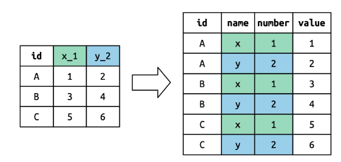

class: center, middle

.linea-superior[]
.linea-inferior[]


# Curso Capacitación en R 

## Sesión 6 

## Bases de datos 4 (Unión y transformación de Bases de Datos)

### Julio 2025

```{r setup, include=FALSE} 
options(htmltools.dir.version = TRUE)
knitr::opts_chunk$set(message = FALSE) 
```


```{r xaringan-themer, include=FALSE, warning=FALSE}
library(xaringanthemer) # gfonts
xaringanExtra::use_clipboard()
xaringanExtra::use_editable(id = "xaringanExtra-editable-demo-1", expires = 1)
```
---

background-image: url("imagenes/background.png")
background-size: contain;
background-position: 50% 0%

# Uniones de Bases de Datos

<br/>
<br/>
.center[]

--

.center[]


---

background-image: url("imagenes/background.png")
background-size: contain;
background-position: 50% 0%

# Uniones de Bases de Datos

<br/>
<br/>

.pull-left[]

--

.pull-right[]

---

background-image: url("imagenes/background.png")
background-size: contain;
background-position: 50% 0%

# Uniones de Bases de Datos

<br/>
<br/>

.center[]


---

background-image: url("imagenes/background.png")
background-size: contain;
background-position: 50% 0%

# Uniones de Bases de Datos

Diagrama de resumen:

<br/>
<br/>

.center[]

---

background-image: url("imagenes/background.png")
background-size: contain;
background-position: 50% 0%

# Uniones de Bases de Datos

Veamos algunos ejemplos:

```{r }
library(dplyr)
miembros_banda <- band_members
instrumentos_banda <- band_instruments
instrumentos2_banda <- band_instruments2
```

--

```{r message=TRUE}
inner_example1 <- miembros_banda |>
  inner_join(instrumentos_banda)
inner_example1
```

---

background-image: url("imagenes/background.png")
background-size: contain;
background-position: 50% 0%

# Uniones de Bases de Datos

Veamos algunos ejemplos:

```{r }
left_example1 <- miembros_banda |>
  left_join(instrumentos_banda)
left_example1
```

--

```{r }
right_example1 <- miembros_banda |>
  right_join(instrumentos_banda)
right_example1
```

---

background-image: url("imagenes/background.png")
background-size: contain;
background-position: 50% 0%

# Uniones de Bases de Datos

```{r }
full_example1 <- miembros_banda |>
  full_join(instrumentos_banda)
full_example1
```

--
A pesar de los ejemplos anteriores que el lenguaje infiere correctamente qué llave 
utilizar para unir las bases, es recomendable siempre **explicitar** la llave utilizada.

```{r }
inner_example2 <- miembros_banda |>
  inner_join(instrumentos_banda, by = join_by(name))
inner_example2
```

---

background-image: url("imagenes/background.png")
background-size: contain;
background-position: 50% 0%

# Uniones de Bases de Datos

```{r }
full_example2 <- miembros_banda |>
  full_join(instrumentos2_banda, by = join_by(name == artist))
full_example2
```
---

background-image: url("imagenes/background.png")
background-size: contain;
background-position: 50% 0%

# Uniones de Bases de Datos

Otros tipos de ejemplos:

```{r }
df1 <- tibble(x = 1:3) # recuerden que un tibble es un data frame
df2 <- tibble(x = c(1, 1, 2), y = c("first", "second", "third"))
df1
df2
```

---

background-image: url("imagenes/background.png")
background-size: contain;
background-position: 50% 0%

# Uniones de Bases de Datos

```{r }
df1_df_2_left <- df1 |>
  left_join(df2, by = join_by(x))
df1_df_2_left
```
--

```{r }
df3 <- tibble(x = c(1, 1, 1, 3))
df3
```

---

background-image: url("imagenes/background.png")
background-size: contain;
background-position: 50% 0%

# Uniones de Bases de Datos

```{r }
df3_df2_left <- df3 |> 
  left_join(df2, by = join_by(x))
df3_df2_left
```


---

background-image: url("imagenes/background.png")
background-size: contain;
background-position: 50% 0%

# Otras funciones de unión

Dos funciones que tambíen son útiles de conocer son: `rbind()` y `cbind()`.

```{r }
df1 <- data.frame(team=c('A', 'A', 'B', 'B', 'C'),
                  points=c(22, 25, 30, 43, 19))

df1
```

```{r }
df2 <- data.frame(team=c('D', 'D', 'E', 'F', 'F'),
                  points=c(11, 36, 29, 22, 30))

df2
```

---

background-image: url("imagenes/background.png")
background-size: contain;
background-position: 50% 0%

# Otras funciones de unión

```{r }
new_df <- rbind(df1, df2)

new_df
```

---

background-image: url("imagenes/background.png")
background-size: contain;
background-position: 50% 0%

# Otras funciones de unión

```{r }
new_df <- cbind(df1, df2)

new_df
```

---

background-image: url("imagenes/background.png")
background-size: contain;
background-position: 50% 0%

# Tidy data

```{r }
library(tidyverse)
```

--

```{r }
table1
```

---

background-image: url("imagenes/background.png")
background-size: contain;
background-position: 50% 0%

# Tidy data

```{r }
table2
```

---

background-image: url("imagenes/background.png")
background-size: contain;
background-position: 50% 0%

# Tidy data

```{r }
table3
```

---

background-image: url("imagenes/background.png")
background-size: contain;
background-position: 50% 0%

# Tidy data

¿Qué hace que un dataset sea *tidy (ordenado)*?

--

**1.- Cada variable (o campo) es una columna; cada columna es una variable (o campo).**

--

**2.- Cada observación es una fila; cada fila es una observación.**

--

**3.- Cada valor es una celda; cada celda es un valor.**

--

.center[]

---

background-image: url("imagenes/background.png")
background-size: contain;
background-position: 50% 0%

# Tidy data

Ventajas de utilizar data que sea **tidy**:

--

1. Es una ventaja escoger una forma consistente de almacenar información. Si se 
tiene una estructura de datos consistente, es más facil aprender las herramientas 
que funcionan en ella debido a que existe una uniformidad subyacente.

--

2. Es una ventaja posicionar variables en columnas ya que permite exprimir 
la capacidad natural de R en términos de vectores. Recordar que la mayoría de funciones en R
funcionan con vectores.

---

background-image: url("imagenes/background.png")
background-size: contain;
background-position: 50% 0%

# Tidy data

La librería `tidy` incluida en la librería `tidyverse` contiene funciones relevantes 
que permiten transformar bases de datos de forma simple y consistente.

--

Veremos en particular, dos funciones: `pivot_longer()` y `pivot_wider()`. Analicemos 
primero la base `billboard` incluida en la librería `tidyr`.

```{r }
billboard
```

---

background-image: url("imagenes/background.png")
background-size: contain;
background-position: 50% 0%

# Tidy data

```{r }
billboard |> 
  pivot_longer(
    cols = starts_with("wk"), # columnas a pivotear
    names_to = "week", # nombra la variable que ahora contiene las ex-columnas
    values_to = "rank" # nombra la variable que ahora contiene los valores
  )
```

---

background-image: url("imagenes/background.png")
background-size: contain;
background-position: 50% 0%

# Tidy data

Analicemos un ejemplo dentro de la base:

```{r }
billboard |> 
  filter(track == "Baby Don't Cry (Keep...")
```

Si notan, esta canción estuvo en los top 100 solamente hasta la semana 7.

---

background-image: url("imagenes/background.png")
background-size: contain;
background-position: 50% 0%

# Tidy data

```{r }
billboard |> 
  pivot_longer(
    cols = starts_with("wk"), 
    names_to = "week", 
    values_to = "rank" 
  ) |> 
  filter(track == "Baby Don't Cry (Keep...")
```

---

background-image: url("imagenes/background.png")
background-size: contain;
background-position: 50% 0%

# Tidy data

```{r }
billboard |> 
  pivot_longer(
    cols = starts_with("wk"), 
    names_to = "week",
    values_to = "rank",
    values_drop_na = TRUE 
  ) |> 
  filter(track == "Baby Don't Cry (Keep...")
```

---

background-image: url("imagenes/background.png")
background-size: contain;
background-position: 50% 0%

# Tidy data

Para finalizar de hacer esta base *tidy* podríamos también dejar la columna 
`week` como númerica utilizando la función `parse_number()` de la librería 
`readr`.

```{r }
billboard_longer <- billboard |> 
  pivot_longer(
    cols = starts_with("wk"), 
    names_to = "week", 
    values_to = "rank",
    values_drop_na = TRUE
  ) |> 
  mutate(
    week = parse_number(week)
  )

billboard_longer
```

---

background-image: url("imagenes/background.png")
background-size: contain;
background-position: 50% 0%

# Tidy data

Veamos un ejemplo más complejo:

```{r }
who2
```

---

background-image: url("imagenes/background.png")
background-size: contain;
background-position: 50% 0%

# Tidy data

Veamos un ejemplo más complejo:

```{r eval=FALSE}
who2 |> 
  pivot_longer(
    cols = !(country:year),
    names_to = c("diagnosis", "gender", "age"), 
    names_sep = "_",
    values_to = "count"
  )
```

---

background-image: url("imagenes/background.png")
background-size: contain;
background-position: 50% 0%

# Tidy data

Veamos un ejemplo más complejo:

```{r }
who2 |> 
  pivot_longer(
    cols = !(country:year),
    names_to = c("diagnosis", "gender", "age"), 
    names_sep = "_",
    values_to = "count"
  )
```

---

background-image: url("imagenes/background.png")
background-size: contain;
background-position: 50% 0%

# Tidy data

<br/>
<br/>
.center[]

---

background-image: url("imagenes/background.png")
background-size: contain;
background-position: 50% 0%

# Tidy data

Ahora veremos la función `pivot_wider()`. Considere el siguiente ejemplo:

```{r }
cms_patient_experience
```

---

background-image: url("imagenes/background.png")
background-size: contain;
background-position: 50% 0%

# Tidy data

```{r }
cms_patient_experience |> 
  distinct(measure_cd, measure_title)
```

---

background-image: url("imagenes/background.png")
background-size: contain;
background-position: 50% 0%

# Tidy data

```{r }
cms_patient_experience |> 
  pivot_wider(
    names_from = measure_cd,
    values_from = prf_rate
  )
```

Mmmm... aún no funciona como queremos.

---

background-image: url("imagenes/background.png")
background-size: contain;
background-position: 50% 0%

# Tidy data

```{r }
cms_patient_experience |> 
  pivot_wider(
    id_cols = starts_with("org"),
    names_from = measure_cd,
    values_from = prf_rate
  )
```

Ahora sí!

