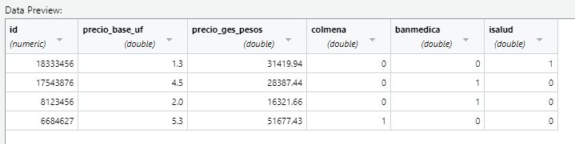
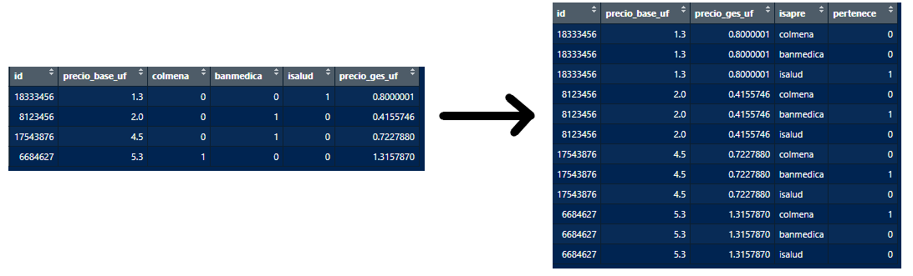
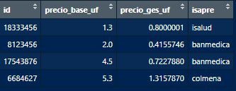

class: center, middle

.linea-superior[]
.linea-inferior[]


# Tarea 5

## Plazo: 11 de julio con puntaje extra o 14 de julio sin extra

```{r setup, include=FALSE} 
options(htmltools.dir.version = TRUE)
knitr::opts_chunk$set(message = FALSE) 
```


```{r xaringan-themer, include=FALSE, warning=FALSE}
library(xaringanthemer) # gfonts
xaringanExtra::use_clipboard()
xaringanExtra::use_editable(id = "xaringanExtra-editable-demo-1", expires = 1)
```

---

background-image: url("imagenes/background.PNG")
background-size: contain;
background-position: 50% 0%

# Preámbulo 

Esta tarea, al igual que las anteriores deberán crear
de cero su script. Por favor sea ordenado y utilice tantos comentarios sean
necesarios para que se acostumbren a que su trabajo sea autoexplicativo.

Recuerde que antes de escribir la respuesta a cada pregunta, debe escribir como comentario
en la línea anterior, el numeral que está respondiendo. Por ejemplo:

```{r }
# Pregunta 2.1 o Pregunta 2: 1, o como usted prefiera
hola <- "hola"
```

Si entregan una respuesta sin antes haber puesto como comentario el numeral en 
la línea anterior tendrán una penalización de **1 décima**.

---

background-image: url("imagenes/background.PNG")
background-size: contain;
background-position: 50% 0%

# Ejercicio 1 (importación de bases de datos)

Como primer ejercicio deberá importar la base de datos en formato csv llamada 
`df_tarea_5.csv`. No pueden modificar este base por fuera de R. Les recomiendo
guardarla y luego utilizar el módulo Import Dataset (arriba a la derecha de R Studio) y 
utilizar **From text (readr)**. Recuerden escribir en el script el código de importación.
Notarán que el id que corresponde a rut no es estándar a lo largo de la base, es su deber
dejar esta variable como `numeric`. A su vez, las columnas `precio_base_uf` y `precio_ges_pesos` 
utilizan la *coma (,)* como separador de decimales. Deben especificarle a R esta característica para que 
importe estas columnas como números (se recomienda en este paso también incluir que la base viene con
separador de miles dado por un *punto (.)*). Por último las columnas asociadas a isapres toman valor $1$ 
cuando el individuo pertenece a esa isapre y $0$ cuando no. 

Por último, vean el separador que se utiliza entre columnas. Recuerden que un archivo de texto o 
plano como lo son los archivos csv pueden estar delimitados por coma, punto y coma, espacios, etc.

En la siguiente diapositiva se muestra como debería quedar la base a importar.

```{r include=FALSE}
library(readr)
df_tarea_5 <- read_delim("df_tarea_5.csv", 
    delim = ";", escape_double = FALSE, col_types = cols(id = col_number()), 
    locale = locale(decimal_mark = ",", grouping_mark = "."), 
    trim_ws = TRUE)
```

---

background-image: url("imagenes/background.PNG")
background-size: contain;
background-position: 50% 0%

# Ejercicio 1 (importación de bases de datos)

<br/>
<br/>

.center[]


Por si acaso, `double` es también un formato númerico.

---

background-image: url("imagenes/background.PNG")
background-size: contain;
background-position: 50% 0%

# Ejercicio 2 (manipulación del dataset)

Utilizando los verbos de la librería `dplyr` genere una nueva variable llamada 
`precio_ges_uf` que corresponda al `precio_ges_pesos` pero en UF. Utilice la UF a un 
precio de $39274.92$ pesos chilenos. Luego elimine la columna llamada `precio_ges_pesos`.
Finalmente ordene la base según la variable `precio_base_uf` de menor a mayor. 
Guarde esta base modificada en un nuevo objeto llamado `df_tarea_5_uf`.

```{r include=FALSE}
library(dplyr)
df_tarea_5_uf <- df_tarea_5 |>
  mutate(precio_ges_uf = precio_ges_pesos/39274.92) |>
  select(-precio_ges_pesos) |>
  arrange(precio_base_uf)
```

---

background-image: url("imagenes/background.PNG")
background-size: contain;
background-position: 50% 0%

# Ejercicio 3

1.- Para este ejercicio es necesario que tengan instalada y cargada la librería `tidyr`.
Suponga que un compañero/a le comenta que la base utilizada en el punto anterior tiene 
el problema que las isapres están como variables (columna) y estas en realidad 
debiesen mostrarse en una sola columna. Dado los conocimientos que usted ha adquirido 
en este curso de R, usted le responde *no hay problema, esto se arregla sencillamente 
utilizando la función `pivot_longer()` de la librería `tidyr`*. Guarde esta nueva base 
en un nuevo objeto llamado `df_tarea_5_uf_pivot`.

Utilice la función `pivot_longer()` para que la base quede de la siguiente forma:

.center[]

```{r include=FALSE}
library(tidyr)
df_tarea_5_uf_pivot <- df_tarea_5_uf |>
  pivot_longer(
    cols = colmena:isalud,
    names_to = "isapre",
    values_to = "pertenece"
  )
```

---

background-image: url("imagenes/background.PNG")
background-size: contain;
background-position: 50% 0%

# Ejercicio 3

2.- Como pueden ver, al pivotear quedó una columna llamada `pertenece` que 
contiene el valor ($1$ o $0$) asociado a si la persona *pertenece* a la isapre. Esto 
claramente desordena la base ya que los id quedan repetidos y en la realidad a nosotros 
solamente nos interesan los registros que pertenecen a una determinada isapre. Dado lo anterior,
utilizando verbos de `dplyr` primero filtre la columna `pertenece` manteniendo sólo aquellas 
filas que tienen valor $1$. Luego elimine la columna `pertenece` de la base. Guarde estos resultados en un 
nuevo objeto llamado `df_tarea_5_limpia_final`. Su base final debiese quedar de la siguiente 
manera:

.center[]

```{r include=FALSE}
df_tarea_5_limpia_final <- df_tarea_5_uf_pivot |>
  filter(pertenece == 1) |>
  select(-pertenece)
```
